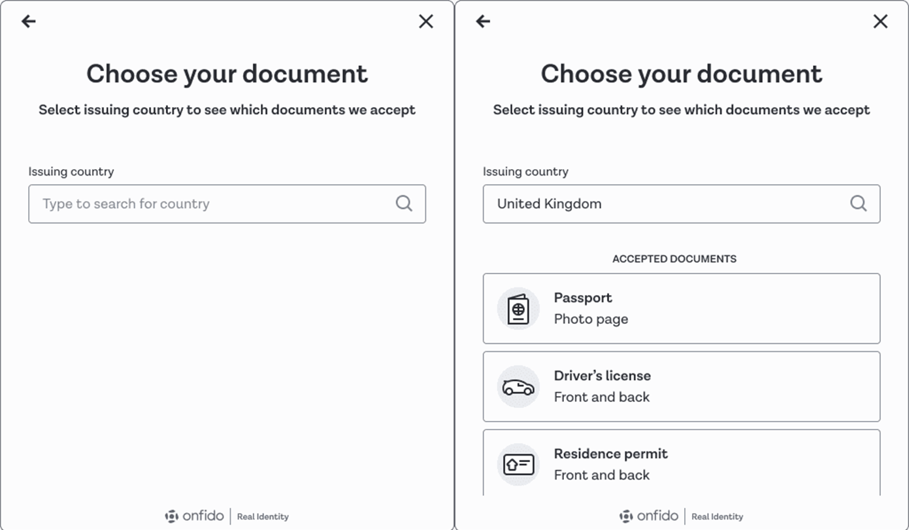
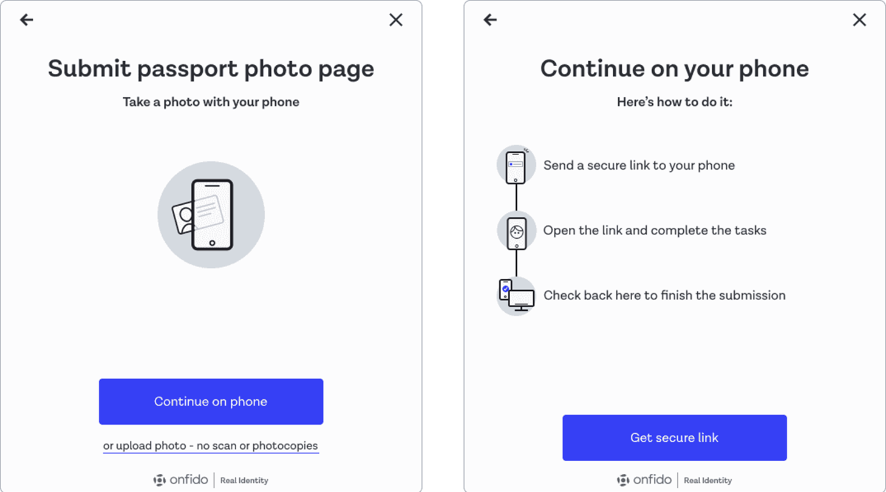
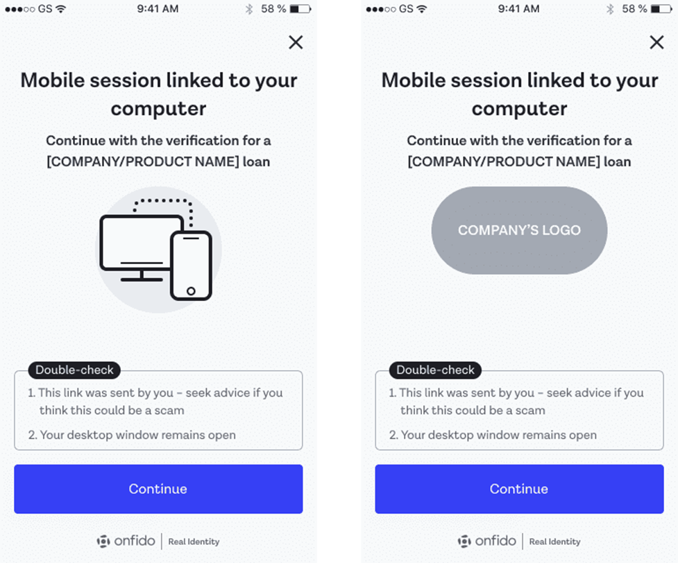

# Onfido SDK UI Layer

[](https://travis-ci.org/onfido/onfido-sdk-ui)
[](https://www.npmjs.com/package/onfido-sdk-ui)

## Table of contents

- [Overview](#overview)
- [General tips](#general-tips)
- [Getting started](#getting-started)
- [Handling callbacks](#handling-callbacks)
- [Removing the SDK](#removing-the-sdk)
- [Initialization options](#initialization-options)
- [Customizing the SDK](#customizing-the-sdk)
- [Creating checks](#creating-checks)
- [User Analytics](#user-analytics)
- [Premium Enterprise Features](#premium-enterprise-features)
- [Going live](#going-live)
- [Accessibility](#accessibility)
- [TypeScript](#typescript)
- [More information](#more-information)

## Overview

The Onfido Web SDK provides a set of components for JavaScript applications to capture identity documents and selfie photos, videos, and motion captures for the purpose of identity verification.

The SDK offers a number of benefits to help you create the best identity verification experience for your customers:

- Carefully designed UI to guide your customers through the entire capture process for photos, videos, or motion captures
- Modular design to help you seamlessly integrate the capture process for photos, videos, or motion captures into your application flow
- Advanced image quality detection technology to ensure the quality of the captured images meets the requirement of the Onfido identity verification process, guaranteeing the best success rate
- Direct image upload to the Onfido service, to simplify integration

⚠️ Note: the SDK is only responsible for capturing photos, videos, and motion captures. You still need to access the [Onfido API](https://documentation.onfido.com/) to manage applicants and perform checks.


## General tips

For use in a mobile device, it is recommended to set up the SDK to use the full screen of the device. Otherwise, there may not be enough room to display all critical elements of the SDK.

## Getting started

The following content assumes you're using our API v3 versions for backend calls. If you are currently using API `v2` please refer to [this migration guide](https://developers.onfido.com/guide/api-v2-to-v3-migration-guide) for more information.

<Callout type="info">

> ℹ️ If you are integrating using Onfido Studio please see out [Studio integration guide](ONFIDO_STUDIO.md).

</Callout>

### 1. Obtain an API token

In order to start integrating, you'll need an [API token](https://documentation.onfido.com/#api-tokens).

You can use our [sandbox](https://documentation.onfido.com/#sandbox-testing) environment to test your integration. To use the sandbox, you'll need to generate a sandbox API token in your [Onfido Dashboard](https://onfido.com/dashboard/api/tokens).

⚠️ **Note: You must never use API tokens in the frontend of your application or malicious users could discover them in your source code. You should only use them on your server.**

#### 1.1 Regions

Onfido offers region-specific environments. Refer to the [Regions](https://documentation.onfido.com/#regions) section in the API documentation for token format and API base URL information.

### 2. Create an applicant

To create an applicant from your backend server, make request to the ['create applicant' endpoint](https://documentation.onfido.com/#create-applicant), using a valid API token.

⚠️ Note: Different report types have different minimum requirements for applicant data. For a Document or Facial Similarity report, the minimum applicant details required are `first_name` and `last_name`.

```shell
$ curl https://api.onfido.com/v3/applicants \
  -H 'Authorization: Token token=<YOUR_API_TOKEN>' \
  -d 'first_name=John' \
  -d 'last_name=Smith'
```

The JSON response will contain an `id` field containing an UUID that identifies the applicant. Once you pass the applicant ID to the SDK, documents, photos, videos, and motion captures uploaded by that instance of the SDK will be associated with that applicant.

### 3. Generate an SDK token

The SDK is authenticated using SDK tokens. Each authenticated instance of the SDK will correspond to a single Onfido applicant. You’ll need to generate and include a new token each time you initialize the Web SDK.

⚠️ Note: You must never use API tokens in the frontend of your application or malicious users could discover them in your source code. You should only use them on your server.

To generate an SDK token, make a request to the ['generate SDK token' endpoint](https://documentation.onfido.com/#generate-web-sdk-token), including the applicant ID and a valid referrer.

```shell
$ curl https://api.onfido.com/v3/sdk_token \
  -H 'Authorization: Token token=<YOUR_API_TOKEN>' \
  -F 'applicant_id=<APPLICANT_ID>' \
  -F 'referrer=<REFERRER_PATTERN>'
```

| Parameter      | Notes                                                            |
| -------------- | ---------------------------------------------------------------- |
| `applicant_id` | **required** <br /> Specifies the applicant for the SDK instance |
| `referrer`     | **optional** <br /> The referrer URL pattern                     |

⚠️ Note: SDK tokens expire after 90 minutes.

#### 3.1 The referrer argument

The referrer argument specifies the URL of the web page where the Web SDK will be used. The referrer sent by the browser must match the referrer URL pattern in the SDK token for the SDK to successfully authenticate.

The referrer pattern guarantees that other malicious websites cannot reuse the SDK token in case it is lost. You can read more about referrer policy [in Mozilla's
documentation](https://developer.mozilla.org/en-US/docs/Web/HTTP/Headers/Referrer-Policy).

⚠️ Note: You must use a site referrer policy that lets the
`Referer` header be sent. If your policy does not allow this (e.g.
`Referrer-Policy: no-referrer`), then you'll receive a `401 bad_referrer`
error when trying to use the Web SDK.

Permitted referrer patterns are as follows:

| Section  | Format                                       | Example                       |
| -------- | -------------------------------------------- | ----------------------------- |
| Referrer | `scheme://host/path`                         | `https://*.<DOMAIN>/<PATH>/*` |
| Scheme   | `*` or `http` or `https`                     | `https`                       |
| Host     | `*` or `*.` then any char except `/` and `*` | `*.<DOMAIN>`                  |
| Path     | Any char or none                             | `<PATH>/*`                    |

An example of a valid referrer is `https://*.example.com/example_page/*`.

### 4. Import the library

You can either:

- use our CDN
- import directly into your HTML page
- use npm

#### 4.1 CDN

You can use hosted versions of the library files from Onfido's CDN.

From SDK 12.3.1 onwards, the version number you subscribe to can vary, depending on your needs:

- subscribing to a specific patch release (e.g. v12.3.1) will fix the library files to that SDK release
- subscribing to a minor level release (e.g. v12.3) means Onfido will update to the latest available patch release
- subscribing to a major release (e.g. v12) means Onfido will update to the latest available patch and minor release

```html
<!-- Replace "<version>" with the actual SDK version you want to use, example: v12 -->
<script src="https://sdk.onfido.com/<version>" charset="utf-8"></script>
<link href="https://sdk.onfido.com/<version>/style.css" rel="stylesheet" />
```

For versions prior to 12.3.1, specifying a precise release only, see our previous [documentation](https://github.com/onfido/onfido-sdk-ui/blob/12.3.0/README.md#43-cdn).

#### 4.2 HTML Script Tag Include

You can include the library as a regular script tag on your page:

```html
<script src="dist/onfido.min.js" charset="utf-8"></script>
```

And the CSS styles:

```html
<link rel="stylesheet" href="dist/style.css" />
```

You can see a [simple example using script tags](https://jsfiddle.net/gh/get/library/pure/onfido/onfido-sdk-ui/tree/master/demo/fiddle/).

#### 4.3 NPM style import

Alternatively, you can import the library as a module into your own JS build system (tested with Webpack):

```shell
$ npm install --save onfido-sdk-ui
```

```javascript
// ES6 module import
import { init } from 'onfido-sdk-ui'

// commonjs style require
var Onfido = require('onfido-sdk-ui')
```

The CSS style will be included inline with the JS code when the library is imported.

⚠️ Note: The library is **Browser only**, it does not support the **Node Context**.

You can see an [example app using npm style import](https://github.com/onfido/onfido-sdk-web-sample-app/).

#### 4.4 Split bundle

To decrease the size of your production bundle, you can use the split version of the library:

```javascript
import { init } from 'onfido-sdk-ui/split'
import 'onfido-sdk-ui/split/css'
```

If you are using TypeScript, you have to enable `moduleResolution` to `Node16 | NodeNext | Bundler`. If it is not possible in your case, you need to add a `@ts-ignore` comment above the import.

⚠️ Note: The main bundle will be in included in your build, but the other bundles will be loaded from Onfido's CDN.

### 5. Add basic HTML markup

Add an empty HTML element at the bottom of your page for the modal interface to mount itself on.

```html
<div id="onfido-mount"></div>
```

### 6. Initialize the SDK

You can now initialize the SDK, using the SDK token.

```javascript
Onfido.init({
  token: '<YOUR_SDK_TOKEN>',
  containerId: 'onfido-mount',
  containerEl: <div id="root" />, //ALTERNATIVE to `containerId`
  onComplete: function (data) {
    console.log('everything is complete')
  },
  steps: ['welcome', 'poa', 'document', 'face', 'complete'],
})
```

| Parameter     | Format           | Notes                                                                                                                                                                                                                                                                                                                                            |
| ------------- | ---------------- | ------------------------------------------------------------------------------------------------------------------------------------------------------------------------------------------------------------------------------------------------------------------------------------------------------------------------------------------------ |
| `token`       | string           | **required** <br />Your Web SDK token                                                                                                                                                                                                                                                                                                            |
| `containerId` | string           | **optional** <br />A string containing the ID of the container element that the UI will mount to. This must be an empty element. The default is `onfido-mount`. <br /> Alternatively, if your integration requires it, you can pass in the container element instead. Note that if `containerEl` is provided, then `containerId` will be ignored |
| `onComplete`  | function         | **optional** A [callback function](#handling-callbacks) that executes after the applicant's document and face have both been captured and uploaded successfully                                                                                                                                                                                  |
| `steps`       | string or object | List of different steps corresponding to parts of the process the user will be presented with                                                                                                                                                                                                                                                    |

## Handling callbacks

### `onComplete {Function} optional`

Callback that fires when both the document and face have been successfully captured and uploaded. You can then trigger your backend to [create a check](https://documentation.onfido.com/#create-check), using the associated applicant ID.

Example `onComplete` callback:

```javascript
Onfido.init({
  token: '<YOUR_SDK_TOKEN>',
  containerId: 'onfido-mount',
  onComplete: function (data) {
    console.log('everything is complete')
  },
})
```

`data` is an object that contains properties of the document and face images captured during the SDK flow.

For two-sided documents like `driving_licence` and `national_identity_card`, the object will also contain a `document_back` property representing the reverse side.

For the face step an object is returned with the `variant` used for the face capture,`'standard' | 'video' | 'motion'`. This informs whether to specify a `facial_similarity_photo`, `facial_similarity_video`, or `facial_similarity_motion` report during check creation.

```javascript
    {
       "document_front": {
         "id": "<DOCUMENT_ID_FRONT>",
         "type": "passport",
         "side": "front"
       },
       "face": {
         "id": "<FACE_ID>",
         "variant": "standard"
       },
       "document_back": {
         "id": "<DOCUMENT_ID_BACK>",
         "type": "driving_licence",
         "side": "back"
       },
       "poa": {
         "id": "<POA_DOCUMENT_ID>"
         "type": "utility_bill"
       }
    }
```

### `onError {Function} optional`

Callback that fires when an error occurs. The callback returns the following error types:

- `exception`
  This will be returned for the following errors:

  - timeout and server errors
  - authorization
  - invalid token
  - missing data in `onComplete` callback

  This data can be used for debugging purposes.

```javascript
{
  type: "exception",
  message: "The request could not be understood by the server, please check your request is correctly formatted"
}
```

- `expired_token`
  This error will be returned when a token has expired. This error type can be used to provide a new token at runtime.

```javascript
{
  type: "expired_token",
  message: "The token has expired, please request a new one"
}
```

### `onUserExit {Function} optional`

Callback that fires when the user abandons the flow without completing it.

The callback returns a string with the reason for leaving. For example, `'USER_CONSENT_DENIED'` is returned when a user exits the flow because they declined the consent prompt.

```javascript
Onfido.init({
  token: '<YOUR_SDK_TOKEN>',
  containerId: 'onfido-mount',
  onUserExit: function (userExitCode) {
    console.log(userExitCode)
  },
})
```

### `onModalRequestClose {Function} optional`

Callback that fires when the user attempts to close the modal.

You can then decide to close the modal or keep it open by changing the property `isModalOpen`.

## Removing the SDK

If you have embedded the SDK inside a single page app, you can call the `safeTearDown` function to remove the SDK completely from the current webpage. It will reset the state and you can safely re-initialize the SDK inside the same webpage later on.

```javascript
onfidoOut = Onfido.init({...})
...
await onfidoOut.safeTearDown()
```

⚠️ **Warning**: The `safeTearDown` method is a Promise. If you plan on mounting the SDK a second (or nth time), please await the promise first.

```javascript
onfidoOut = Onfido.init({...})
await onfidoOut.safeTearDown()
onfidoOut2 = Onfido.init({...})
```

## Initialization options

- **`token {String} required`**

  A JWT is required in order to authorize with our WebSocket endpoint. If one isn’t present, an exception will be thrown.

- **`useModal {Boolean} optional`**

  Turns the SDK into a modal, which fades the background and puts the SDK into a contained box. The default value is `false`.

  ```javascript
  <script>
      var onfido = {}

      function triggerOnfido() {
        onfido = Onfido.init({
          useModal: true,
          isModalOpen: true,
          onModalRequestClose: function() {
            // Update options with the state of the modal
            onfido.setOptions({isModalOpen: false})
          },
          token: '<YOUR_SDK_TOKEN>',
          onComplete: function(data) {
            // callback for when everything is complete
            console.log("everything is complete")
          }
        });
      };
  </script>

  <body>
    <!-- Use a button to trigger the Onfido SDK  -->
    <button onClick="triggerOnfido()">Verify identity</button>
    <div id='onfido-mount'></div>
  </body>
  ```

- **`isModalOpen {Boolean} optional`**

  Defines whether the modal is open or closed, if `useModal` is set to `true`. The default value is `false`.

  To change the state of the modal after calling `init()` you need to use `setOptions()`.

- **`shouldCloseOnOverlayClick {Boolean} optional`**

  If `useModal` is set to `true`, by default the user can close the SDK by clicking on the close button or on the background overlay. You can disable the user's ability to close the SDK by clicking the background overlay through setting `shouldCloseOnOverlayClick` to `false`. The default value is `true`.

- **`autoFocusOnInitialScreenTitle {Boolean} optional`**

  Sets the SDK to auto focus on the initial screen's title. By default the SDK will auto focus on every screen's title. When disabled, auto focus will not be applied for the initial screen's title. The SDK will still auto focus to all subsequent screens' titles as the user goes through the steps. The default value is `true`.

- **`containerId {String} optional`**

  A string of the ID of the container element that the UI will mount to. This needs to be an empty element. The default ID is `onfido-mount`. If your integration needs to pass the container element itself, use `containerEl` as described next.

- **`containerEl {Element} optional`**

  The container element that the UI will mount to. This needs to be an empty element. This can be used as an alternative to passing in the container ID string previously described for `containerId`. Note that if `containerEl` is provided, then `containerId` will be ignored.

- **`smsNumberCountryCode {String} optional`**

  You can change the default country for the SMS number input by passing the `smsNumberCountryCode` option when the SDK is initialized. The value should be a string containing a 2-character ISO Country code. If empty, the SMS number country code will default to `GB`.

  ```javascript
  smsNumberCountryCode: 'US'
  ```

- **`userDetails {Object} optional`**

  The following user details can be specified ahead of time, so that the user doesn't need to provide the information themselves:

  - `smsNumber` (optional) : The user's mobile number, which can be used for sending SMS messages to the user, for example, when a user requests to use their mobile devices to take photos. The value should be a string containing the mobile number with a country code.

  ```javascript
  userDetails: {
    smsNumber: '+447500123456'
  }
  ```

- **`steps {List} optional`**

  The list of different steps to be shown in the SDK flow and their custom options. Each step can either be specified as a string (when no customization is required) or an object (when customization is required).

  ```javascript
  steps: [
    {
      type: 'welcome',
      options: {
        title: 'Open your new bank account',
      },
    },
    'document',
    'face',
  ]
  ```

  See [flow customization](#flow-customization) for details of the custom options for each step.

## Customizing the SDK

The Web SDK has multiple customizable features that provide flexibility, while also being easy to integrate. You can also read our [SDK customization guide](https://developers.onfido.com/guide/sdk-customization).

### UI customization

- **`customUI {Object} optional`**

  Please refer to the [SDK UI customization documentation](UI_CUSTOMIZATION.md) for details of the supported UI customization options that can be set in this property.

### Language Localization

- **`language {String || Object} optional`**

  You can customize the language displayed on the SDK by passing a string or object.
  If `language` is not present we will use the browser's language setting. If the browser's language is not supported, we will default to English (`en_US`).

  #### Supported languages

  The SDK supports and maintains the following languages. These can be implemented directly inside the SDK by passing the `language` option as a string containing the supported language tag.

  | Language                 | Locale Tag | Direction |
  | ------------------------ | ---------- | --------- |
  | Arabic                   | "ar"       | rtl       |
  | Armenian                 | "hy"       |           |
  | Bulgarian                | "bg"       |           |
  | Chinese (Simplified)     | "zh_CN"    |           |
  | Chinese (Traditional)    | "zh_TW"    |           |
  | Croatian                 | "hr"       |           |
  | Czech                    | "cs"       |           |
  | Danish                   | "da"       |           |
  | Dutch                    | "nl"       |           |
  | English (United Kingdom) | "en_GB"    |           |
  | English (United States)  | "en_US"    |           |
  | Estonian                 | "et"       |           |
  | Finnish                  | "fi"       |           |
  | French                   | "fr"       |           |
  | French (Canadian)        | "fr_CA"    |           |
  | German                   | "de"       |           |
  | Greek                    | "el"       |           |
  | Hebrew                   | "he"       | rtl       |
  | Hindi                    | "hi"       |           |
  | Hungarian                | "hu"       |           |
  | Indonesian               | "id"       |           |
  | Italian                  | "it"       |           |
  | Japanese                 | "ja"       |           |
  | Korean                   | "ko"       |           |
  | Latvian                  | "lv"       |           |
  | Lithuanian               | "lt"       |           |
  | Malay                    | "ms"       |           |
  | Norwegian                | "no"       |           |
  | Persian                  | "fa"       | rtl       |
  | Polish                   | "pl"       |           |
  | Portuguese               | "pt"       |           |
  | Portuguese (Brazil)      | "pt_BR"    |           |
  | Romanian                 | "ro"       |           |
  | Russian                  | "ru"       |           |
  | Serbian                  | "sr"       |           |
  | Slovak                   | "sk"       |           |
  | Slovenian                | "sl"       |           |
  | Spanish                  | "es"       |           |
  | Spanish (Latin America)  | "es_419"   |           |
  | Swedish                  | "sv"       |           |
  | Thai                     | "th"       |           |
  | Turkish                  | "tr"       |           |
  | Ukrainian                | "uk"       |           |
  | Vietnamese               | "vi"       |           |

  Example:

  ```javascript
  language: 'pt_BR' | 'es'
  ```

  #### Custom languages

  The SDK can also be displayed in a custom language for locales that Onfido does not currently support. To implement this, pass an object containing the following keys:

  | Key             | Description                                                                                | Notes                                                                                                                                                                                                                                                                                                                                                                                                                                                                                                                                                                                             |
  | --------------- | ------------------------------------------------------------------------------------------ | ------------------------------------------------------------------------------------------------------------------------------------------------------------------------------------------------------------------------------------------------------------------------------------------------------------------------------------------------------------------------------------------------------------------------------------------------------------------------------------------------------------------------------------------------------------------------------------------------- |
  | `locale`        | **required** <br /> A locale tag.                                                          | This is required when providing phrases for an unsupported language. You can also use this to partially customize the strings of a supported language (e.g. Spanish), by passing a supported language locale tag (e.g. `es_ES`). For missing keys, the values will be displayed in the language specified within the locale tag if supported, otherwise they will be displayed in English. The locale tag is also used to override the language of the SMS body for the cross device feature. This feature is owned by Onfido and is currently only supports English, Spanish, French and German. |
  | `direction`     | **optional** <br /> Direction of reading                                                   | Set the direction of reading, either left-to-right or right-to-left. Values: `ltr` or `rtl`. Default: `ltr`                                                                                                                                                                                                                                                                                                                                                                                                                                                                                       |
  | `phrases`       | **required** <br /> An object containing the keys you want to override and the new values. | The keys can be found in [`src/locales/en_US/en_US.json`](src/locales/en_US/en_US.json). They can be passed as a nested object or as a string using the dot notation for nested values. See the examples below.                                                                                                                                                                                                                                                                                                                                                                                   |
  | `mobilePhrases` | **optional** <br /> An object containing the keys you want to override and the new values. | The values specified within this object are only visible on mobile devices. Please refer to the `mobilePhrases` property in [`src/locales/en_US/en_US.json`](src/locales/en_US/en_US.json). **Note**: support for standalone `mobilePhrases` key will be deprecated soon. Consider nesting it inside `phrases` if applicable.                                                                                                                                                                                                                                                                     |

  ```javascript
  language: {
    locale: 'en_US',
    direction: 'ltr',
    phrases: { welcome: { title: 'My custom title' } },
    mobilePhrases: {
      'capture.driving_licence.instructions': 'This string will only appear on mobile'
    }
  }
  ```

### Flow customization

#### welcome

This step is the introduction screen of the SDK. It displays a summary of the capture steps the user will pass through. These steps can be specified to match the flow required. This is an optional screen.

The custom options are:

- `title` (string)
- `descriptions` ([string])
- `nextButton` (string)

#### document

In the Document Capture step, an end user can select the issuing country and document type before capture.

This information is used to optimize the capture experience, as well as inform the end user about which documents they are allowed to use.

This selection screen is optional, and will be automatically hidden where the end user is not required to indicate which document will be captured.

By default, when the selection screen is shown, the country selection will be empty.



_The above images are for web SDK versions 8.3.0+. For previous designs, see previous SDK reference guides_

You can specify allowed issuing countries and document types for the document capture step in one of three ways:

- If you are using Onfido Studio, this is configured within a Document Capture task, documented in the [Studio Product Guide](https://developers.onfido.com/guide/onfido-studio-product#document-capture-task)
- Otherwise, for Onfido Classic you can set this globally in your Dashboard (recommended), or hard code it into your SDK integration. Both of these options are documented below

##### Country and document type selection by Dashboard

Configuring the issuing country and document type selection step using your Dashboard is the recommended method of customization (available from [Web SDK](https://documentation.onfido.com/sdk/web/) version 10.0.0 onwards) as this configuration is also applied to your Document Reports. Any document that has been uploaded by an end user against your guidance will result in a Document Report sub-result of "rejected" and be flagged as `Image Integrity` > `Supported Document`.

_We will be rolling out Dashboard-based configuration of allowed documents soon. In the meantime, contact [support@onfido.com](mailto:support@onfido.com) or your Customer Support Manager to request access to this feature_.

- Open the Accounts tab on your [Dashboard](https://dashboard.onfido.com/), then click Supported Documents
- You will be presented with a list of all available countries and their associated supported documents. Make your selection, then click Save Change


**Please note:**

- Hard coding any document type and issuing country configuration in your SDK integration will fully override the Dashboard-based settings
- Currently, only passport, national ID card, driving licence and residence permit are visible for document selection by the end user in the SDK. If you nominate other document types in your Dashboard (visa, for example), these will not be displayed in the user interface
- If you need to add other document types to the document selection screen, you can mitigate this limitation in the near-term, using the Custom Document feature
- If for any reason the configuration fails or is not enabled, the SDK will fallback to display the selection screen for the complete list of documents supported within the selection screens

##### Country and document type selection - SDK integration code

If you want to use your own custom document selection UI instead of displaying the Onfido document selection screen, you will need to specify the document details during SDK initialization.

The document selection screen will be skipped automatically when the single document type is specified.

The SDK will accept the following:

- The **Document Type** is required. This controls fundamental SDK document capture behaviour
- The **Country** is optional, but recommended. This enables any optimizations the SDK may have for this specific document issued by this country
- The **Document Format** is optional, and only accepted for French driving licence, Italian national identity card and South African national identity card This defaults to Card, representing modern forms of these documents. If the end user indicates that they have an older, paper version of one of these documents, use Folded to ensure an optimized capture experience

The custom options are:

- `documentTypes` (object)

  The list of document types visible to the user can be filtered by using the `documentTypes` option. When `documentTypes` is not defined, the default value for each document type is `true`. When `documentTypes` is defined, it will override the default values. Absent types are considered `false`.

- `country` (string)

  Document country can be specified per document type. The `country` configuration for a document type allows you to specify the issuing country of the document as a string containing a 3-letter ISO 3166-1 alpha-3 country code.

  If `documentTypes` only includes one document type with a country value, users will not see the document selection screen and instead will be taken directly to the capture screen.

  ⚠️ **Note**: the `null` value is deprecated and has no effect.

  ⚠️ **Note**: Passports have the same format worldwide so the SDK will not show the country selection screen even if they are not restricted by country (e.g. passport: true).

For example, if you want to allow only Spanish (ESP) driving licences, and national identity cards and residence permits for all countries:

```json
{
  "steps": [
    "welcome",
    {
      "type": "document",
      "options": {
        "documentTypes": {
          "driving_licence": {
            "country": "ESP"
          },
          "national_identity_card": true,
          "residence_permit": true
        }
      }
    },
    "complete"
  ]
}
```

In the Web SDK, it is also possible to remove the country selection entirely from the document selection screen. Set the hideCountrySelection option to true to show all supported document types in a single list with no country selection. Note that, without capturing the country information, the SDK is unable to apply optimized capture experiences for specific documents, and we are not able to perform fine-grained analytics based on country selection.

See more details in the Technical Reference [here](https://documentation.onfido.com/sdk/web/).

**Note**: You may still wish to configure the Dashboard-based approach to ensure that the Document Report also rejects any document that has been uploaded by an end user against your guidance.

##### Cross-device flow

The Web SDK offers a cross-device flow where desktop users are directed to continue on their mobile device browser to complete the capture process, providing vastly improved image quality versus a typical desktop webcam and an increased likelihood of live capture.

The user is offered a QR code to scan with their camera app, which then resumes the flow on their mobile device browser. For users that cannot scan a QR code, a Copy Link feature and Send Link with SMS feature are also available. Regardless of the cross-device method, the secure URL is unique to this session.

When a user switches to the SDK's cross-device flow, they will see an [introductory screen](https://developers.onfido.com/guide/sdk-customization#cross-device---mobile-client-introductory-screen) when the SDK client loads on their mobile browser. At the end of the capture process, users will be redirected back to their desktop to complete the SDK flow.

It is recommended to enforce the cross-device flow. The option is available in Onfido Studio, configurable in the [workflow builder](https://developers.onfido.com/guide/onfido-studio-product#document-capture-task).

In a Classic integration, the cross-device flow is configured by setting `forceCrossDevice` to true:

```javascript
options: {
  forceCrossDevice: true
}
```

- When configured, `forceCrossDevice` makes the cross-device flow mandatory for all users who will be required to complete the capture process on a mobile device browser
- The `forceCrossDevice` functionality can be configured for both the Document capture and Proof of Address verification steps
- `forceCrossDevice` cannot be configured for Face captures



When a user switches to the SDK's cross-device flow, they will see an introductory screen when the SDK client loads on their mobile browser. This screen notifies the user that this is part of a flow initiated on a desktop browser when they open the cross-device link on their mobile browser.

The following optional customizations are available for the introductory screen:

- Specify company or product name

  - `crossDeviceClientIntroProductName`
  - You can customize the text by adding your company or product name to the subtitle
  - We recommend that you set this so that the user can identify the purpose of the flow when they open the cross-device link. This is also an opportunity to include your branding in the SDK flow

- Display company or product logo
  - `crossDeviceClientIntroProductLogoSrc`
  - You can customize the icon by adding your company or product logo to be displayed instead of the default SDK icon image
  - We recommend that you set this so that the user can identify the purpose of the flow when they open the cross-device link. This is also an opportunity to include your branding in the SDK flow
  - The image used should be no more than 144px in both height and width



- `genericDocumentTypes` (object)

  You can add generic documents that are not supported by Onfido. They will be displayed at the bottom of the built-in document types.

  ```javascript
  genericDocumentTypes: [
    {
      id: 'my_single_side_document',
      title: 'My single side document',
      subTitle: 'Details about my document',
      country: 'ALB',
      pages: 1,
    },
    {
      id: 'my_two_sides_document',
      title: 'My two sides document',
      subTitle: 'Details about my document',
      country: 'ALB',
      pages: 2,
    },
  ]
  ```

  In the same way to other document types, you can skip the document selection screen by adding a single `generic_document` object which references one of your generic documents declared in `genericDocumentTypes`.

  ```javascript
  documentTypes: {
    generic_document: {
      id: 'my_single_side_document',
    }
  }
  ```

#### poa

This is the Proof of Address capture step. Users will be asked to select the issuing country of their document, the document type, and to provide images of their selected document. They will also have a chance to check the quality of the images before confirming. There are no custom options for this step.

#### face

This is the face capture step. Users will be asked to capture their face in the form of a photo, a video, or a motion capture. For photos and videos, they will also have a chance to check its quality before confirming.

The custom options are:

- `requestedVariant` (string - default: `standard`)

  A preferred variant can be requested for this step, by passing the option `requestedVariant: 'standard' | 'video' | 'motion'`. If `requestedVariant` is:

  - `standard`: a photo will be captured;
  - `video`: a video will be captured;
  - `motion`: a motion capture will be captured.

  The SDK will try to fulfil this request depending on camera availability, device capabilities, and browser support on the user's device:

  - if a video cannot be taken, the face step can be configured to fallback to the `standard` variant (see `photoCaptureFallback`);
  - if Motion is not available, the face step can be configured to fallback to either `video` or `standard` variants (see `motionFallbackVariant`).

  If the SDK is initialized with the `requestedVariant` option for the face step, make sure you use the data returned in the [`onComplete` callback](#handling-callbacks) to request the correct report when creating a check.

- `useMultipleSelfieCapture` (boolean - default: `true`)

  When enabled, this feature allows the SDK to take additional selfie snapshots to help improve face similarity check accuracy. When disabled, only one selfie photo will be taken.

- `photoCaptureFallback` (boolean - default: `true`)

  This feature only applies to the [Video](https://developers.onfido.com/guide/facial-similarity-reports#video) variant.

  When enabled, it allows end-users to capture a selfie if their browser does not support MediaRecorder.
  When disabled, we will return an unsupported browser error if the end-user browser doesn’t support MediaRecorder.

- `showIntro` (boolean - default: `true`)

  This feature applies to [Video](https://developers.onfido.com/guide/facial-similarity-reports#video) and [Standard](https://developers.onfido.com/guide/facial-similarity-reports#standard) variants.

  When disabled for the Standard variant, it will remove the entire intro screen from the flow.
  When disabled for the Video variant, it will hide the example video displayed in the intro screen, only showing the text instructions.

- `motionFallbackVariant` (string - default: `undefined`)

  This feature only applies to the [Motion](https://developers.onfido.com/guide/facial-similarity-reports#motion) variant and it allows to specify which face capture variant users will fallback to if Motion is not available on the end-user device due to MediaRecorder not being supported or to limited device capabilities.

  If no variant is specified, then users on unsupported devices will receive an unsupported browser error instead.

  The following example shows how to configure `motionFallbackVariant` to allow users on unsupported devices to fallback to Selfie:

  ```javascript
  options: {
    requestedVariant: 'motion',
    motionFallbackVariant: 'standard'
  }
  ```

  The following example shows how to configure `motionFallbackVariant` to allow users on unsupported devices to fallback to Video:

  ```javascript
  options: {
    requestedVariant: 'motion',
    motionFallbackVariant: 'video'
  }
  ```

- `recordMotionAudio` (boolean - default: `false`)

  When enabled, and the requested variant is `motion`, this feature allows Motion to record the user background audio.

Please note that if a camera can’t be detected, we forward the user to the cross-device flow in order to attempt to capture in another device.

#### complete

This is the final completion step. The screen displays a completion message to signal the next steps to the user. This is an optional screen. The custom options are:

- `message` (string)
- `submessage` (string)

#### Cross device - mobile client introductory screen

When a user switches to the SDK's Cross Device flow, they will see an introductory screen when the SDK client loads on their mobile browser.


- **`crossDeviceClientIntroProductName {String} optional`**

  You can customize the text by adding your company or product name to the subtitle with this option. We recommend that you set this, alongside the corresponding `crossDeviceClientIntroProductLogoSrc` below, to notify the user that this is part of a flow initiated on a desktop or laptop browser when they open the Cross Device link on their mobile browser. This is also an opportunity to include your branding in the SDK flow.

  ```javascript
  Onfido.init({
    token: '<YOUR_SDK_TOKEN>',
    crossDeviceClientIntroProductName: 'for a [COMPANY/PRODUCT NAME] loan',
  })
  ```

  

- **`crossDeviceClientIntroProductLogoSrc {String} optional`**

  You can customize the icon by adding your company or product logo to be displayed instead of the default SDK icon image with this option. We recommend that you set this, alongside the corresponding `crossDeviceClientIntroProductName` above, to notify the user that this is part of a flow initiated on a desktop browser when they open the Cross Device link on their mobile browser. This is also an opportunity to include your branding in the SDK flow.
  The image used should be no more than 144px in both height and width.

  ```javascript
  Onfido.init({
    token: '<YOUR_SDK_TOKEN>',
    crossDeviceClientIntroProductLogoSrc: 'path://to/logo/image/file',
  })
  ```

  

### Changing options in runtime

It's possible to change the options initialized at runtime:

```javascript
onfidoOut = Onfido.init({...})
...
//Change the title of the welcome screen
onfidoOut.setOptions({
  steps: [
    {
      type:'welcome',
      options:{title:"New title!"}
    },
    'document',
    'face',
    'complete'
  ]
});
...
//replace the jwt token
onfidoOut.setOptions({ token: '<YOUR_NEW_SDK_TOKEN>' });
...
//Open the modal
onfidoOut.setOptions({ isModalOpen:true });
```

The new options will be shallowly merged with the previous one, so you can only pass the differences to a get a new flow.

## Creating checks

The SDK is responsible for the capture of identity documents and selfie photos, videos, and motion captures. It doesn't perform any checks against the [Onfido API](https://documentation.onfido.com/). You need to access the Onfido API in order to manage applicants and perform checks.

### 1. Creating a check

For a walkthrough of how to create a document and facial similarity check using the Web SDK read our [Web SDK Quick Start guide](https://developers.onfido.com/guide/web-sdk-quick-start).

For further details on how to [create a check](https://documentation.onfido.com/#create-check) with the Onfido API.

Note: If you are testing with a sandbox token, please be aware that the results are pre-determined. You can learn more about [sandbox responses](https://documentation.onfido.com/#pre-determined-responses).

Note: If you are currently using API `v2` please refer to [this migration guide](https://developers.onfido.com/guide/api-v2-to-v3-migration-guide) for more information.

### 2. Setting up webhooks

Reports may not always return actual [results](https://documentation.onfido.com/#results) straightaway.

You can [set up webhooks](https://developers.onfido.com/guide/get-started-integrating#set-up-a-webhook) to be notified upon completion of a check or report, or both.

## User Analytics

The SDK allows you to track a user's journey through the verification process via a dispatched event. This gives insight into how your users make use of the SDK screens.

### Overriding the hook

In order to track a user's progress through the SDK an `EventListener` must be added that listens for `UserAnalyticsEvent` events. This can be done anywhere within your application.

For example:

```javascript
addEventListener('userAnalyticsEvent', (event) => /*Your code here*/);
```

The code inside of the `EventListener` will now be called when a particular event is triggered. For a full list of events see [tracked events](#tracked-events).

The parameter being passed in is an `Event` object. The details related to the user analytics event can be found at the path `event.detail` and are as follows:

|              |                                                                                                                                              |
| ------------ | -------------------------------------------------------------------------------------------------------------------------------------------- |
| `eventName`  | **string** <br /> Indicates the type of event. This will always be returned as `"Screen"` as each tracked event is a user visiting a screen. |
| `properties` | **map object** <br /> Contains the specific details of an event. For example, the name of the screen visited.                                |

### Using the data

You can use the data to monitor how many users reach each screen in your flow. You can do this by storing the number of users that reach each screen and comparing that to the number of users who reached the `Welcome` screen.

### Tracked events

Below is the list of potential events currently being tracked by the hook:

```
WELCOME - User reached the "Welcome" screen
USER_CONSENT - User reached the "User Consent" screen
DOCUMENT_TYPE_SELECT - User reached the "Choose document" screen where the type of document to upload can be selected
ID_DOCUMENT_COUNTRY_SELECT - User reached the "Select issuing country" screen where the the appropriate issuing country can be searched for and selected if supported
CROSS_DEVICE_INTRO - User reached the cross device "Continue on your phone" intro screen
CROSS_DEVICE_GET_LINK - User reached the cross device "Get your secure link" screen
CROSS_DEVICE_START - User reached the "document capture" screen on mobile after visiting the cross device link
DOCUMENT_CAPTURE_FRONT - User reached the "document capture" screen for the front side (for one-sided or two-sided document)
DOCUMENT_CAPTURE_BACK - User reached the "document capture" screen for the back side (for two-sided document)
DOCUMENT_CAPTURE_CONFIRMATION_FRONT - User reached the "document confirmation" screen for the front side (for one-sided or two-sided document)
DOCUMENT_CAPTURE_CONFIRMATION_BACK - User reached the "document confirmation" screen for the back side (for two-sided document)
FACIAL_INTRO - User reached the "selfie intro" screen
FACIAL_CAPTURE - User reached the "selfie capture" screen
FACIAL_CAPTURE_CONFIRMATION - User reached the "selfie confirmation" screen
VIDEO_FACIAL_INTRO - User reached the "face video intro" screen
VIDEO_FACIAL_CAPTURE_STEP_1 - User reached the 1st challenge during "face video capture", challenge_type can be found in eventProperties
VIDEO_FACIAL_CAPTURE_STEP_2 - User reached the 2nd challenge during "face video capture", challenge_type can be found in eventProperties
MOTION_FACIAL_INTRO - User reached the "motion intro" screen
MOTION_FACIAL_ALIGNMENT - User reached the "motion alignment" screen
MOTION_FACIAL_CAPTURE - User reached the "motion capture" screen
MOTION_FACIAL_NO_FACE_DETECTED - User's face was not detected
MOTION_FACIAL_CAPTURE_ERROR_TIMEOUT - User's motion capture timed out
MOTION_FACIAL_CAPTURE_ERROR_TOO_FAST - User performed the motion headturn too fast
MOTION_FACIAL_UPLOAD - User's motion capture is uploading
MOTION_FACIAL_UPLOAD_COMPLETED - User's motion capture finished uploading
MOTION_FACIAL_CONNECTION_ERROR - User was presented the "motion connection error" screen during upload
UPLOAD - User's file is uploading
```

## Premium Enterprise Features

Please refer to the [Premium Enterprise Features documentation](ENTERPRISE_FEATURES.md) for details of the following features offered to our Enterprise customers:

- Customized API Requests
- Callbacks Overview
- Cross device URL

The above features must be enabled for your account before they can be used. For more information, please contact your Onfido Solution Engineer or Customer Success Manager.

## Going live

Once you are happy with your integration and are ready to go live, please contact [client-support@onfido.com](mailto:client-support@onfido.com) to obtain a live API token. You will have to replace the sandbox token in your code with the live token.

Check the following before you go live:

- you have set up [webhooks](https://documentation.onfido.com/#webhooks) to receive live events
- you have entered correct billing details inside your [Onfido Dashboard](https://onfido.com/dashboard/)

## Accessibility

The Onfido SDK has been optimised to provide the following accessibility support by default:

- Screen reader support: accessible labels for textual and non-textual elements available to aid screen reader navigation, including dynamic alerts
- Keyboard navigation: all interactive elements are reachable using a keyboard
- Sufficient color contrast: default colors have been tested to meet the recommended level of contrast
- Sufficient touch target size: all interactive elements have been designed to meet the recommended touch target size

Refer to our [accessibility statement](https://developers.onfido.com/guide/sdk-accessibility-statement) for more details.

⚠️ Note: If you make your own UI customizations, you are responsible for ensuring that the UI changes will still adhere to accessibility standards. For example, accessible color contrast ratios and dyslexic friendly fonts.

## TypeScript

From version `6.5.0`, TypeScript is officially supported, providing typings for:

- `init()` method
- `options` argument (`SdkOptions`) and return object (`SdkHandle`) of `init()` method
- Arguments (`SdkResponse` and `SdkError`) for `onComplete()` and `onError()` callbacks
- `steps` option (`StepTypes` and `StepConfig`)
- `language` option (`SupportedLanguages` and `LocaleConfig`)
- `region` option (`ServerRegions`)

## More information

### Browser compatibility

|  |  |  |  |
| --------------------------------------------------------------------------------------------------- | ------------------------------------------------------------------------------------------------------ | --------------------------------------------------------------------------------------------- | --------------------------------------------------------------------------------------------------- |
| Latest ✔                                                                                            | Latest ✔                                                                                               | Latest ✔                                                                                      | Latest ✔                                                                                            |

### Node.js compatibility

The SDK is compatible with the all supported Node.js versions (currently starting with Node.js 16).

### Troubleshooting

#### Content Security Policy issues

In order to mitigate potential cross-site scripting issues, most modern browsers use a Content Security Policy (CSP). These policies might prevent the SDK from correctly displaying the images captured during the flow or correctly load styles. If CSP is blocking some of the SDK functionalities, make sure you add the following snippet inside the `<head>` tag of your application.

```html
<meta
  http-equiv="Content-Security-Policy"
  content="
  default-src 'self' https://assets.onfido.com;
  script-src 'self' 'unsafe-eval' https://assets.onfido.com https://sentry.io https://*.sardine.ai/;
  style-src 'self' 'unsafe-inline' https://assets.onfido.com https://sdk.onfido.com;
  font-src 'self' https://sdk.onfido.com;
  connect-src 'self' data: blob: *.onfido.com wss://*.onfido.com https://sentry.io;
  img-src 'self' data: blob: https://assets.onfido.com/;
  media-src blob: https://assets.onfido.com;
  worker-src 'self' blob:;
  object-src 'self' blob:;
  frame-src 'self' data: blob: https://*.sardine.ai/;
"
/>
```

#### SDK navigation issues

In rare cases, the SDK back button might not work as expected within the application history. This is due to the interaction of `history/createBrowserHistory` with the browser history API.
If you notice that by clicking on the SDK back button, you get redirected to the page that preceeded the SDK initialization, you might want to consider using the following configuration option when initialising the SDK: `useMemoryHistory: true`. This option allows the SDK to use the `history/createMemoryHistory` function, instead of the default `history/createBrowserHistory`. This option is intended as workaround, while a more permanent fix is implemented.

Example:

```javascript
Onfido.init({
  useMemoryHistory: true,
})
```

#### Iframe camera and microphone permission issues

If embedded inside a cross-origin iframe, the SDK may fail to access the camera and microphone. This is a known issue on recent Chrome versions where requests fail in a similar way as if a user had denied a permission prompt. You may need to add the following `allow` attribute to your iframe:

```html
<iframe src="..." allow="camera;microphone"></iframe>
```

#### Upload fallback

Onfido Web SDK versions <13.0.0 have a parameter named `uploadFallback` that can be set on both the document step and the face step. This parameter allowed clients to present end-users with a file input capability during the SDK flow. This client-side optional parameter has been removed in Web SDK 13 and above to enhance security which means users will not have the option to upload files during the SDK flow. However, file upload can be enabled as an option for end-users as a backend configuration if requested through the Onfido Support Team.

### Support

Should you encounter any technical issues during integration, please contact Onfido's Customer Support team via [email](mailto:support@onfido.com), including the word ISSUE: at the start of the subject line.

Alternatively, you can search the support documentation available via the customer experience portal, [public.support.onfido.com](http://public.support.onfido.com).

Previous versions of the SDK will be supported for a month after a new major version release. Note that when the support period has expired for an SDK version, no bug fixes will be provided, but the SDK will keep functioning (until further notice).

## How is the Onfido SDK licensed?

Please see [LICENSE](https://github.com/onfido/onfido-sdk-ui/blob/master/LICENSE) for licensing details.
